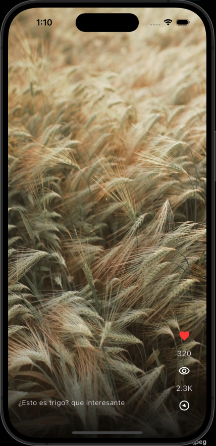
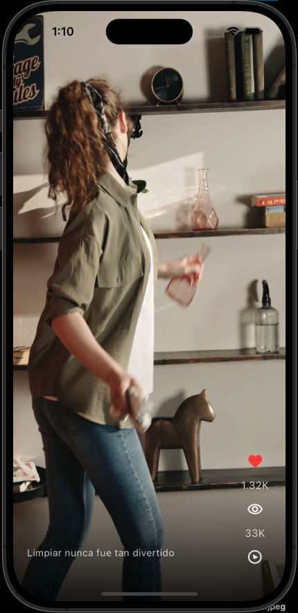
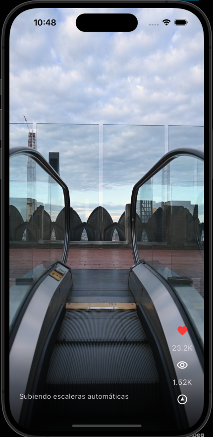

# VerticalVideos

## Description

VerticalVideos is an app designed to visualize vertical videos locally. The app allows users to watch videos that are stored on the device and provides basic controls, such as play and pause, to easily manage the viewing experience.

## Features

- Displays vertical videos stored locally on the device.
- Simple controls for pausing and playing videos.
- Smooth user interface optimized for mobile screens.

## Screenshots

  
  
  

*From left to right: Home screen, Video player, and Settings screen.*

## Getting Started

This project is a starting point for a Flutter application.

A few resources to get you started if this is your first Flutter project:

- [Lab: Write your first Flutter app](https://docs.flutter.dev/get-started/codelab)
- [Cookbook: Useful Flutter samples](https://docs.flutter.dev/cookbook)

For help getting started with Flutter development, view the
[online documentation](https://docs.flutter.dev/), which offers tutorials,
samples, guidance on mobile development, and a full API reference.
